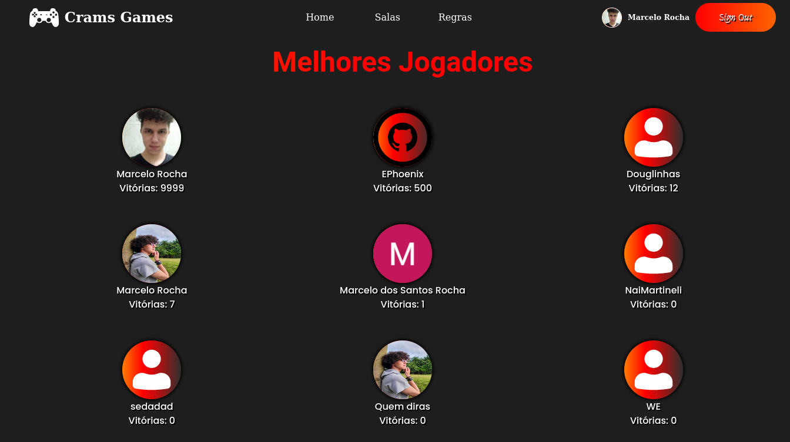

# Gaming Site - Cram's

---

<a href='https://gaming-site-4e8d8.web.app/' target='_blank'>See Online</a>

---

## About/Sobre:

This is my first attempt to make a full front-end ReactJS project all by myself, without search videos or tutorials, only Official Documentations allowed.
The Crams Gaming site, is a platform to play a card game called "No, Thanks!" online with friends, it has a turn based game in real time with 3 to 6 players. The site also features a game lobby with chat, a page for search games, a leaderboard showing the best 9 players, login with Google, register and login in my own data and email verification, sign out and the user can change their profile picture.

Essa é minha primeira tentativa em realizar um projeto Front-End completo com ReactJS, sem procurar por videos ou tutoriais, utilizando apenas documentações oficiais.
O site Crams Gaming, é uma plataforma para jogar um jogo de carta chamado "No, Thanks!" online com amigos, tem um jogo baseado em turnos jogável entre 3 a 6 jogadores. O site também apresenta um lobby com bate-papo, uma página para encontrar jogos, quadro de melhores jogadores, conexão com o Google, registro e conexão no meu próprio sistema (com verificação de email) e o usuário consegue trocar sua foto de perfil.

---

## Technologies/Tecnologias:

- HTML5;
- SASS;
- Javascript;
- ReactJS;
- Firebase;
- React-Modal lib;

---

## Features:

- Login with Google;
- Register;
- Email authentication;
- Image upload, for user profile picture;
- Leaderboard;
- Search Lobby page;
- Lobby page with chat and ready state;
- Game page for 3 to 6 players;
- Loading animation

---

## Pages:

### Login:

### Register:

### Leaderboard:

### Rules:

### Search:

### Lobby:

### Rules modal:

### In game:

